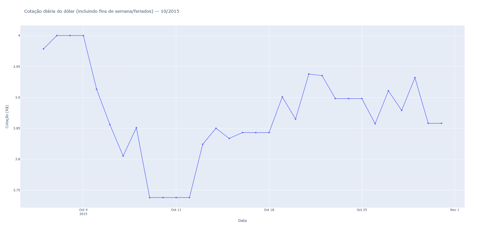

```python
# Importa as bibliotecas
import requests
import pandas as pd
import plotly.express as px
import calendar
from datetime import datetime

def grafico_dolar_mensal(mmyyyy: str):
    # Converte MMYYYY para datas
    first_date = datetime.strptime(mmyyyy, "%m%Y")
    last_day = calendar.monthrange(first_date.year, first_date.month)[1]
    last_date = first_date.replace(day=last_day)

    # Prepara datas para API
    data_inicio = first_date.strftime("%m-%d-%Y")
    data_fim = last_date.strftime("%m-%d-%Y")

    # URL da API
    url = (
        "https://olinda.bcb.gov.br/olinda/servico/PTAX/versao/v1/odata/"
        "CotacaoDolarPeriodo(dataInicial=@dataInicial,dataFinalCotacao=@dataFinalCotacao)"
        f"?@dataInicial='{data_inicio}'&@dataFinalCotacao='{data_fim}'"
        "&$format=json&$select=cotacaoCompra,dataHoraCotacao"
    )

    # Busca dados
    r = requests.get(url).json()["value"]

    # Organiza em DataFrame
    df = pd.DataFrame(r)
    df["data"] = pd.to_datetime(df["dataHoraCotacao"]).dt.date
    df = df.rename(columns={"cotacaoCompra": "cotacao"})
    df = df[["data", "cotacao"]]

    # Filtra o mês
    df = df[(df["data"] >= first_date.date()) & (df["data"] <= last_date.date())]

    # Cria todos os dias para preencher falhas
    todos_dias = pd.date_range(start=first_date, end=last_date).date
    df_full = pd.DataFrame({"data": todos_dias})
    df_full = df_full.merge(df, on="data", how="left")
    df_full["cotacao"] = df_full["cotacao"].ffill()

    # Gráfico Plotly
    fig = px.line(df_full, x="data", y="cotacao", markers=True,
                  title=f"Cotação do dólar — {mmyyyy[:2]}/{mmyyyy[2:]}")
    fig.show()

    return df_full
grafico_dolar_mensal("102015")
```