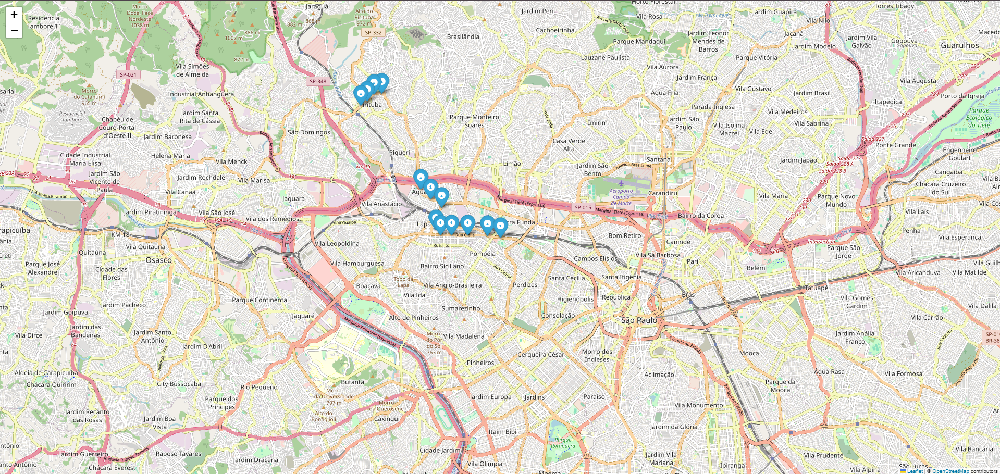

```python
# Importa bibliotecas
import requests
from folium import Map, Marker, Icon

# Configurações da API
TOKEN = "0bcedc5fb833ad11ab7d362a8df8838e587bf07991a463e111fc04c17f240ab5"
LINHA = "948A"
SENTIDO = 1  # 1 = ida, 2 = volta

# Autenticação
sess = requests.Session()
sess.post("http://api.olhovivo.sptrans.com.br/v2.1/Login/Autenticar",
          params={"token": TOKEN})

# Busca a linha
linha = sess.get("http://api.olhovivo.sptrans.com.br/v2.1/Linha/Buscar",
                 params={"termosBusca": LINHA}).json()
codigo = linha[0]["cl"]

# Busca paradas
paradas_raw = sess.get(
    "http://api.olhovivo.sptrans.com.br/v2.1/Parada/BuscarParadasPorLinha",
    params={"codigoLinha": codigo}
).json()

paradas = [p for p in paradas_raw if "py" in p and "px" in p]

# Posição dos ônibus
pos = sess.get("http://api.olhovivo.sptrans.com.br/v2.1/Posicao/Linha",
               params={"codigoLinha": codigo}).json()

veiculos = [v for v in pos.get("vs", []) if v.get("sl") == SENTIDO]

# Mapa
m = Map(location=[paradas[0]["py"], paradas[0]["px"]], zoom_start=13)

# Marca paradas
for p in paradas:
    Marker([p["py"], p["px"]], popup=p.get("np", "Parada"),
           icon=Icon(color="blue")).add_to(m)

# Marca ônibus
for v in veiculos:
    Marker([v["py"], v["px"]], popup=f"Ônibus {v.get('p', '?')}",
           icon=Icon(color="red")).add_to(m)

# Abre o mapa
m.show_in_browser()


```