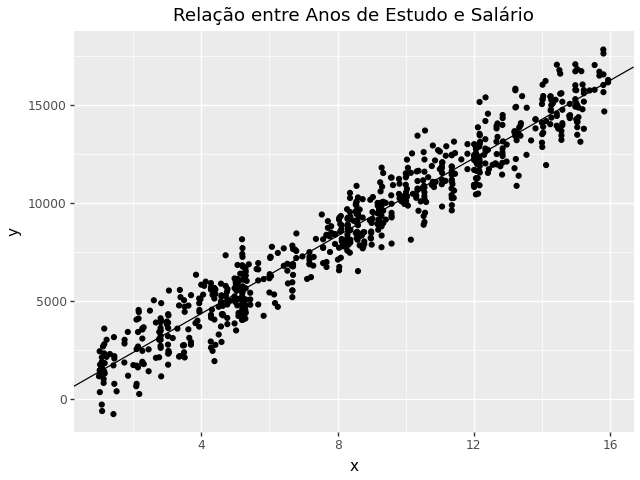

```python
# Importa bibliotecas
import numpy as np
import pandas as pd
from plotnine import ggplot, aes, geom_point, geom_abline, ggtitle

# Carrega os valores
X = np.loadtxt("X.txt")
y = np.loadtxt("y.txt")

# Matriz para cálculo da regressão
X_design = np.c_[np.ones(X.shape[0]), X]

# Fórmula da regressão
beta = np.linalg.inv(X_design.T @ X_design) @ X_design.T @ y
a, b = beta[0], beta[1]

# DataFrame
df = pd.DataFrame({"x": X, "y": y})

# Gráfico
plot = (
    ggplot(df, aes("x", "y"))
    + geom_point()
    + geom_abline(intercept=a, slope=b)
    + ggtitle("Anos de Estudo x Salário")
)

print(plot)
plot.save("grafico_regressao.png")

```